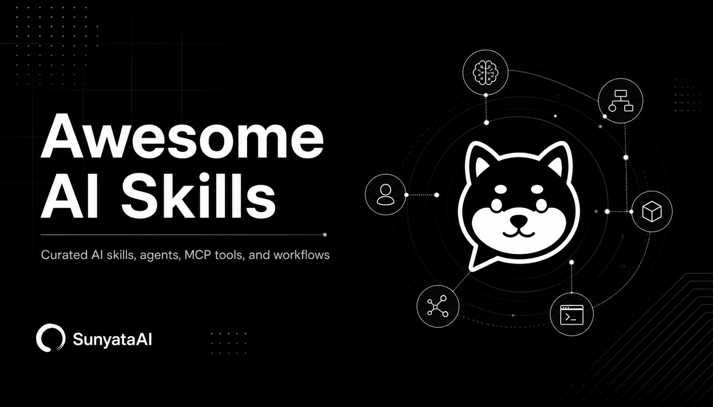

<p align="center">
  
</p>

<p align="center">
  <a href="README.zh-CN.md"><strong>简体中文</strong></a>
  ·
  <a href="https://sunyataai.com"><strong>SunyataAI</strong></a>
  ·
  <a href="mailto:sunyataai@outlook.com"><strong>Contact</strong></a>
</p>

# Awesome AI Skills

Awesome AI Skills is a curated open source catalog maintained by SunyataAI. It tracks high-quality AI skills, agent projects, MCP tools, automation workflows, developer tooling, and applied AI products.

The goal is simple: make the fast-moving AI tooling ecosystem easier to search, compare, understand, and reuse.

## About SunyataAI

SunyataAI is building an open AI community for the next generation of human-agent collaboration. It is a place for creators, developers, researchers, and intelligent agents to share knowledge, discover tools, connect real needs, and shape how AI becomes part of everyday creation and work.

- Website: [sunyataai.com](https://sunyataai.com)
- Contact: [sunyataai@outlook.com](mailto:sunyataai@outlook.com)

## Scope

- AI skills, agent skills, prompts, and reusable workflows
- Agent frameworks and multi-agent orchestration projects
- MCP servers, clients, tools, and integration examples
- AI developer tools, CLIs, SDKs, evaluation tools, and observability projects
- Practical AI applications with reusable architecture or workflow value
- High-quality learning resources for AI agents and AI-native software

## Categories

| Category | Description |
| --- | --- |
| `skills` | Reusable AI skills, task recipes, and agent workflows |
| `agents` | Agent frameworks, multi-agent systems, and task runners |
| `mcp` | MCP servers, clients, integrations, and protocol examples |
| `developer-tools` | CLIs, SDKs, debugging, evaluation, and observability tools |
| `applications` | Practical AI applications with reusable product or architecture ideas |
| `research-learning` | Papers, tutorials, courses, guides, and case studies |

## Featured Index

| Project | Category | Tags | Why It Matters |
| --- | --- | --- | --- |
| [modelcontextprotocol/servers](https://github.com/modelcontextprotocol/servers) | `mcp` | MCP, integrations, tools | Reference MCP server implementations and common integrations. |
| [openai/openai-cookbook](https://github.com/openai/openai-cookbook) | `developer-tools` | examples, recipes, SDK | Practical examples for building with OpenAI APIs and AI workflows. |
| [microsoft/autogen](https://github.com/microsoft/autogen) | `agents` | multi-agent, orchestration | A widely referenced framework for building multi-agent applications. |
| [crewAIInc/crewAI](https://github.com/crewAIInc/crewAI) | `agents` | agents, workflow | A popular project for role-based agent workflow orchestration. |
| [langchain-ai/langchain](https://github.com/langchain-ai/langchain) | `developer-tools` | framework, integrations | Broad ecosystem for LLM application development and integrations. |
| [diffusionstudio/lottie](https://github.com/diffusionstudio/lottie) | `skills` | Lottie, motion, Skia | Generates and verifies editable Lottie JSON animations in an official local player. |
| [greensock/gsap-skills](https://github.com/greensock/gsap-skills) | `skills` | GSAP, animation, ScrollTrigger | Eight official skills covering GSAP core, timelines, frameworks, plugins, and performance. |
| [songsummer920-dazzle/three-scope-map-skill](https://github.com/songsummer920-dazzle/three-scope-map-skill) | `skills` | Three.js, 3D maps, Vue | A template-driven skill for building and validating drill-down 3D geographic maps. |
| [Paidax01/web-to-design-md](https://github.com/Paidax01/web-to-design-md) | `skills` | design extraction, browser, DESIGN.md | Converts a live website into a reusable design system document and HTML preview. |
| [shadcn skill](https://ui.shadcn.com/docs/skills) | `skills` | shadcn/ui, components, CLI | Official project-aware guidance for composing and maintaining shadcn/ui interfaces. |
| [zhongerxin/cowart](https://github.com/zhongerxin/cowart) | `developer-tools` | Codex plugin, tldraw, canvas, image generation | Adds a project-local infinite canvas for visual thinking, AI image generation, and annotation-driven iteration. |
| [eze-is/web-access](https://github.com/eze-is/web-access) | `skills` | web access, CDP, browser automation | Gives agents a structured web-access layer with tool selection, browser CDP control, local browser history lookup, and parallel research patterns. |
| [bozhouDev/codex-orange-book](https://github.com/bozhouDev/codex-orange-book) | `research-learning` | Codex, guide, workflow, PDF | A Chinese open guide that explains Codex installation, workflows, skills, MCP, plugins, and practical examples. |
| [inlineresearch/Inline-Studio](https://github.com/inlineresearch/Inline-Studio) | `applications` | ComfyUI, visual art, node canvas, desktop app | A desktop creative tool for building, iterating, exporting, and sharing generative visual pipelines on top of a user's own ComfyUI. |
| [nexu-io/open-design](https://github.com/nexu-io/open-design) | `applications` | design, prototypes, skills, desktop app | A local-first open source design workspace with hundreds of skills and design systems for creating prototypes, slides, images, videos, and exports. |
| [Thysrael/Horizon](https://github.com/Thysrael/Horizon) | `applications` | news radar, briefing, bilingual, automation | An AI-powered personal news radar that generates daily English and Chinese briefings. |
| [VoltAgent/awesome-design-md](https://github.com/VoltAgent/awesome-design-md) | `research-learning` | DESIGN.md, design systems, UI generation | A curated set of DESIGN.md analyses for popular brand design systems, useful for guiding coding agents toward consistent UI output. |
| [ymzhang10/account-registration-guides](https://github.com/ymzhang10/account-registration-guides) | `research-learning` | account setup, subscriptions, ChatGPT, Apple Account | Chinese guides for registering and subscribing to common AI and developer-adjacent services such as ChatGPT, Gmail, and Apple accounts. |
| [MiniMax-AI/skills](https://github.com/MiniMax-AI/skills) | `skills` | coding agents, frontend, mobile, multimodal | Official MiniMax skills for AI coding agents, covering frontend, fullstack, mobile, shaders, documents, spreadsheets, presentations, and multimodal generation. |
| [openai/codex](https://github.com/openai/codex) | `developer-tools` | coding agent, terminal, Rust, CLI | OpenAI's lightweight coding agent that runs in the terminal for agentic software development workflows. |
| [yt-dlp/yt-dlp](https://github.com/yt-dlp/yt-dlp) | `developer-tools` | media downloader, CLI, audio, video | A feature-rich command-line audio/video downloader that is useful in media collection, dataset preparation, and automation workflows. |
| [op7418/Humanizer-zh](https://github.com/op7418/Humanizer-zh) | `skills` | writing, Chinese, Claude Code, style rewriting | A Chinese-localized Claude Code skill for making generated text read more naturally and less mechanically. |
| [pbakaus/impeccable](https://github.com/pbakaus/impeccable) | `research-learning` | design language, AI UI, design systems, agents | A design language for making AI-powered coding and creative tools produce stronger visual design outcomes. |
| [Leonxlnx/taste-skill](https://github.com/Leonxlnx/taste-skill) | `skills` | taste, design critique, AI output quality | A skill that pushes AI agents away from generic output and toward more opinionated, visually stronger work. |
| [calesthio/OpenMontage](https://github.com/calesthio/OpenMontage) | `applications` | video production, agents, pipelines, skills | An open source agentic video production system with pipelines, tools, and agent skills for turning coding assistants into video studios. |
| [KimYx0207/HookPrompt](https://github.com/KimYx0207/HookPrompt) | `skills` | prompt optimization, hooks, Claude Code, Codex | A UserPromptSubmit hook that turns ordinary user prompts into structured, role-first task briefs before the agent executes them. |
| [anYuJia/better-douyin](https://github.com/anYuJia/better-douyin) | `developer-tools` | Douyin, media archive, downloader, desktop app | A local Douyin content preview, download, and archive tool for personal research, lawful backup, and source-level customization. |
| [panggungunvibe/atutun-xhs-cover](https://github.com/panggungunvibe/atutun-xhs-cover) | `skills` | Xiaohongshu, cover design, prompt generation, social media | A Codex skill for turning topics, articles, reviews, tutorials, and recommendations into image-generation prompts for high-impact Xiaohongshu covers. |
| [Emily2040/seedance-2.0](https://github.com/Emily2040/seedance-2.0) | `skills` | Seedance 2.0, AI filmmaking, video generation, multimodal | A modular Seedance 2.0 Skill OS for directing AI video generations with scene intent, references, continuity, safety rewrites, and delivery workflows. |
| [JimLiu/baoyu-design](https://github.com/JimLiu/baoyu-design) | `skills` | Claude Design, UI mockups, prototypes, HTML | A portable Agent Skill that brings Claude Design-style UI mockups, prototypes, decks, wireframes, and self-contained HTML deliverables into local coding agents. |
| [KKKKhazix/khazix-skills](https://github.com/KKKKhazix/khazix-skills#-storage-analyzer清理垃圾) | `skills` | storage analyzer, cleanup, Agent Skills, HTML report | A collection of Agent Skills, including `storage-analyzer` for scanning disk usage, producing an interactive cleanup report, and guiding safe trash/removal decisions. |

## Entry Format

Each project is stored as structured data in [`data/projects.yml`](data/projects.yml).

```yaml
- name: project-name
  repo: owner/repo
  url: https://github.com/owner/repo
  category: agents
  tags:
    - multi-agent
    - workflow
  languages:
    - Python
  summary_zh: 简短中文介绍。
  summary_en: Short English summary.
  why_it_matters_zh: 为什么值得关注。
  why_it_matters_en: Why this project is worth tracking.
  status: active
```

## Review Notes

When adding or reviewing a project, prefer concrete observations over vague praise.

- Use case: what problem does it solve?
- Reusability: can the idea, architecture, or workflow be reused?
- Maturity: is the project maintained and usable?
- Integration value: does it connect well with other AI tools or protocols?
- Learning value: does it help readers understand AI-native software design?
- Risk: are there security, privacy, maintenance, or lock-in concerns?

## Repository Structure

```text
.
├── README.md
├── README.zh-CN.md
├── assets/
│   └── awesome-ai-skills-banner.png
├── data/
│   └── projects.yml
├── CONTRIBUTING.md
├── LICENSE
└── .github/
    └── ISSUE_TEMPLATE/
        └── recommend-project.yml
```

## Contributing

Suggest a project by opening an issue with the recommendation template. Pull requests are welcome when the entry is factual, categorized clearly, and includes a concrete reason for inclusion.

## Maintainer

Maintained by [SunyataAI](https://sunyataai.com).
