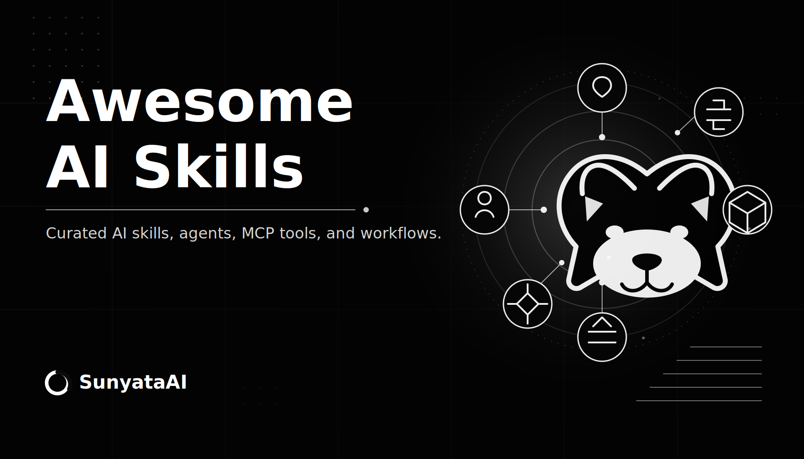

<p align="center">
  
</p>

<p align="center">
  <a href="README.md"><strong>English</strong></a>
  ·
  <a href="https://sunyataai.com"><strong>SunyataAI</strong></a>
  ·
  <a href="mailto:sunyataai@outlook.com"><strong>联系</strong></a>
</p>

# Awesome AI Skills

Awesome AI Skills 是由 SunyataAI 维护的开源精选目录，用于持续收集、介绍和分类整理优秀的 AI skills、Agent 项目、MCP 工具、自动化工作流、开发者工具和应用型 AI 产品。

这个仓库的目标很直接：让快速变化的 AI 工具体系更容易搜索、比较、理解和复用。

## 关于 SunyataAI

SunyataAI 正在建设面向下一代人机协作的开放式 AI 社区。我们希望让创作者、开发者、研究者和智能 Agent 在这里共享知识、发现工具、连接真实需求，并共同塑造 AI 进入日常创造与工作的方式。

- 官网：[sunyataai.com](https://sunyataai.com)
- 联系方式：[sunyataai@outlook.com](mailto:sunyataai@outlook.com)

## 收录范围

- AI skills、Agent skills、提示词和可复用工作流
- Agent 框架和多 Agent 编排项目
- MCP server、client、工具接入和协议示例
- AI 开发者工具、CLI、SDK、评估工具和可观测性项目
- 具备可复用架构或工作流价值的 AI 应用
- AI Agent 和 AI-native 软件相关的高质量学习资料

## 分类

| 分类 | 说明 |
| --- | --- |
| `skills` | 可复用 AI skills、任务模板和 Agent 工作流 |
| `agents` | Agent 框架、多 Agent 系统和任务执行工具 |
| `mcp` | MCP servers、clients、集成工具和协议示例 |
| `developer-tools` | CLI、SDK、调试、评估和可观测性工具 |
| `applications` | 有产品或架构参考价值的 AI 应用 |
| `research-learning` | 论文、教程、课程、指南和案例研究 |

## 精选索引

| 项目 | 分类 | 标签 | 价值 |
| --- | --- | --- | --- |
| [modelcontextprotocol/servers](https://github.com/modelcontextprotocol/servers) | `mcp` | MCP, integrations, tools | MCP 官方服务器实现和常见工具集成参考。 |
| [openai/openai-cookbook](https://github.com/openai/openai-cookbook) | `developer-tools` | examples, recipes, SDK | OpenAI API 和 AI 工作流的实践示例。 |
| [microsoft/autogen](https://github.com/microsoft/autogen) | `agents` | multi-agent, orchestration | 多 Agent 应用开发方向的代表性框架。 |
| [crewAIInc/crewAI](https://github.com/crewAIInc/crewAI) | `agents` | agents, workflow | 面向角色分工和流程编排的热门 Agent 项目。 |
| [langchain-ai/langchain](https://github.com/langchain-ai/langchain) | `developer-tools` | framework, integrations | 覆盖模型、检索、工具、Agent 和集成的 LLM 应用生态。 |
| [diffusionstudio/lottie](https://github.com/diffusionstudio/lottie) | `skills` | Lottie, motion, Skia | 创建并验证可编辑 Lottie JSON 动画。 |
| [greensock/gsap-skills](https://github.com/greensock/gsap-skills) | `skills` | GSAP, animation, ScrollTrigger | GSAP 官方 skills，覆盖核心动画、时间线、插件和性能。 |
| [songsummer920-dazzle/three-scope-map-skill](https://github.com/songsummer920-dazzle/three-scope-map-skill) | `skills` | Three.js, 3D maps, Vue | 用于构建和验证多层级 3D 地图的模板化 skill。 |
| [Paidax01/web-to-design-md](https://github.com/Paidax01/web-to-design-md) | `skills` | design extraction, browser, DESIGN.md | 将真实网站整理成可复用的设计系统文档和 HTML 预览。 |
| [shadcn skill](https://ui.shadcn.com/docs/skills) | `skills` | shadcn/ui, components, CLI | shadcn/ui 官方 Agent skill，帮助稳定组合和维护界面组件。 |
| [zhongerxin/cowart](https://github.com/zhongerxin/cowart) | `developer-tools` | Codex plugin, tldraw, canvas, image generation | 为 Codex 增加项目本地无限画布、图片生成和标注迭代能力。 |
| [eze-is/web-access](https://github.com/eze-is/web-access) | `skills` | web access, CDP, browser automation | 为 Agent 提供结构化联网访问、浏览器控制和并行研究能力。 |
| [bozhouDev/codex-orange-book](https://github.com/bozhouDev/codex-orange-book) | `research-learning` | Codex, guide, workflow, PDF | 中文 Codex 使用指南，覆盖安装、skills、MCP、插件和实战案例。 |
| [inlineresearch/Inline-Studio](https://github.com/inlineresearch/Inline-Studio) | `applications` | ComfyUI, visual art, node canvas, desktop app | 基于 ComfyUI 的桌面视觉创作工具，支持生成、迭代、导出和分享。 |

## 条目格式

所有项目以结构化数据保存在 [`data/projects.yml`](data/projects.yml)。

```yaml
- name: project-name
  repo: owner/repo
  url: https://github.com/owner/repo
  category: agents
  tags:
    - multi-agent
    - workflow
  languages:
    - Python
  summary_zh: 简短中文介绍。
  summary_en: Short English summary.
  why_it_matters_zh: 为什么值得关注。
  why_it_matters_en: Why this project is worth tracking.
  status: active
```

## 解读维度

收录和解读项目时，优先写可验证的信息，避免空泛评价。

- 用途：它解决什么问题？
- 复用性：思路、架构或工作流是否可复用？
- 成熟度：项目是否仍在维护，是否可用？
- 集成价值：是否能和其他 AI 工具或协议良好连接？
- 学习价值：是否能帮助理解 AI-native 软件设计？
- 风险：是否存在安全、隐私、维护或锁定风险？

## 参与贡献

你可以通过 Issue 推荐项目。也欢迎提交 PR，但请保证信息准确、分类清晰，并说明为什么值得收录。

## 维护者

由 [SunyataAI](https://sunyataai.com) 维护。
